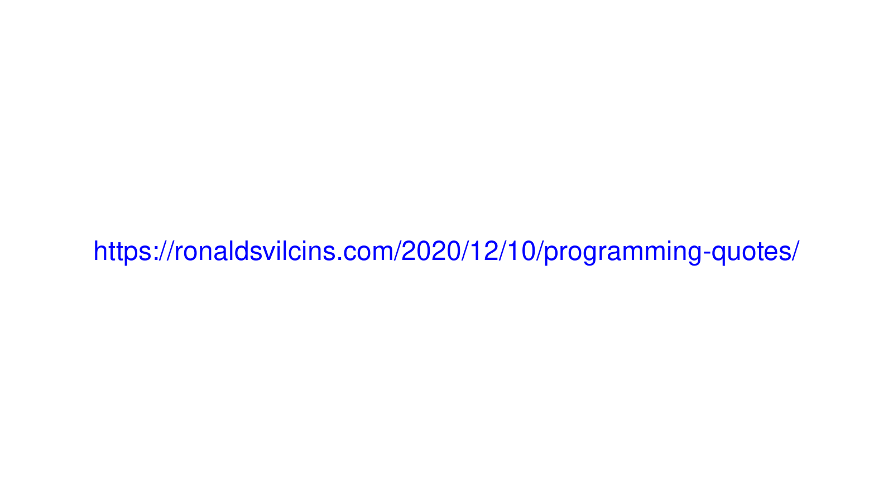

# Useful Python Scripts

Example gif created by make_gif.py.

## make_gif_images.py

This script generates the images for a gif.

It uses imagemagick so you must have imagemagick installed.

The text, colors, and filenames for the output images are coded into the script.

It doesn't create a gif in case you want to add a custom image or change the ordering before gif creation.

Run it like this:

python make_gif_images.py

## make_gif.py

This script generates a complete gif from the text and colors you specify. 

It uses imagemagick so you must have imagemagick installed.

It is very similar to make_gif_images.py, with an extra line at the end to create a gif from those images.

The text, colors, and filenames for the output images are coded into the script.

Run it like this:

python make_gif.py

## annotate_image.py

This script annotates an image with text at the bottom.

It uses imagemagick so you must have imagemagick installed.

If you have a screenshot for example, you can use it to add a quick description.

As written, the script will append a small caption at the bottom of the image, using the text you enter, in black text centered on a white background.

Run it like this, for an example input of input.png and output of output.png:

python annotate.py input.png output.png "Linus Torvalds created Linux."

## api_tmdb_get_movie_print_info.py

This script prints the homepage and description for a movie - here, Star Wars.

To get this information, it uses the API for TMDB (The Movie Database), a free resource with no cost for personal usage API requests.

Note: you'll have to get your own API key from TMDB and add it as an env var under the name MOVIEDB_API_KEY in order to successfully run this script.

Run it like this:

python api_tmdb_get_movie_print_info.py
