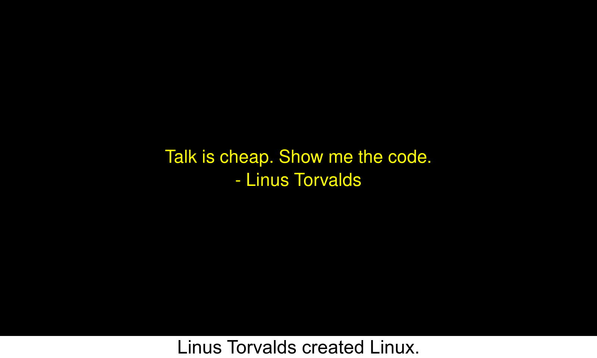

# Useful Python Scripts

Example gif created by make_gif.py.

## make_gif_images.py

This script generates the images for a gif.

It uses imagemagick so you must have imagemagick installed.

The text, colors, and filenames for the output images are coded into the script.

It doesn't create a gif in case you want to add a custom image or change the ordering before gif creation.

Run it like this:

python make_gif_images.py

## make_gif.py

This script generates a complete gif from the text and colors you specify. 

It uses imagemagick so you must have imagemagick installed.

It is very similar to make_gif_images.py, with an extra line at the end to create a gif from those images.

The text, colors, and filenames for the output images are coded into the script.

Run it like this:

python make_gif.py

## annotate_image.py

This script annotates an image with text at the bottom.

It uses imagemagick so you must have imagemagick installed.

If you have a screenshot for example, you can use it to add a quick description.

As written, the script will append a small caption at the bottom of the image, using the text you enter, in black text centered on a white background.

Run it like this, for an example input of input.png and output of output.png:

python annotate.py input.png output.png "Linus Torvalds created Linux."

## api_tmdb_get_movie_print_info.py

This script prints the homepage and description for a movie - here, Star Wars.

To get this information, it uses the API for TMDB (The Movie Database), a free resource with no cost for personal usage API requests.

Note: you'll have to get your own API key from TMDB and add it as an env var under the name MOVIEDB_API_KEY in order to successfully run this script.

Run it like this:

python api_tmdb_get_movie_print_info.py

## number_guessing_game.py

This script sets up a NumberGuessingGame class which allows you to create and play a number guessing game.

The game generates a random number within a specified range and challenges the user to guess it within a limited number of attempts.

## guess_the_number.py

This script utilizes the NumberGuessingGame class to create and play a number guessing game. 

By default, the game's parameters are set to guess a random number between 1 and 100 within a maximum of 10 attempts. 

The target number is 42 but you can customize the target number by setting custom_target to a specific value or comment out the relevant lines to continue guessing a random number. 

When executed, the script guides the user through the game, providing feedback and ultimately revealing the outcome of their guesses.

## test_number_guessing_game.py

This script contains a unit test for the NumberGuessingGame class. 

Test Cases:

test_check_the_guess_too_low: Tests whether the check_the_guess method correctly identifies a guess as "Too low" when the user's guess is less than the target number.

test_check_the_guess_too_high: Tests whether the check_the_guess method correctly identifies a guess as "Too high" when the user's guess is greater than the target number.

test_check_the_guess_correct: Tests whether the check_the_guess method correctly identifies a guess as "You guessed it!" when the user's guess matches the target number.
